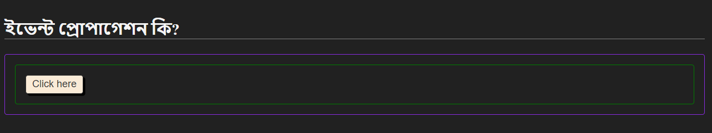
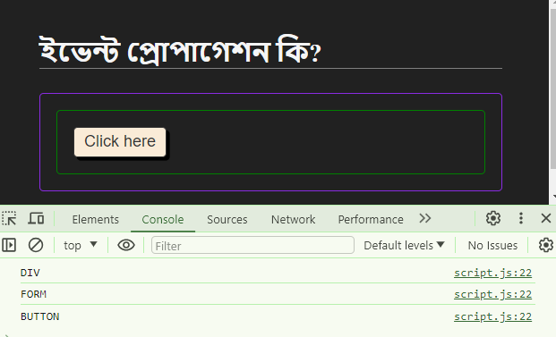

# Event Propagation In Javascript DOM

## What is Event Propagation?

Propagation মানে হচ্ছে চলাচল করা। আমরা যখন JS এ কোন Event নিয়ে কাজ করি তখন এই Event গুলো কোন অর্ডারে চলাচল করবে এই প্রসেস টাই হচ্ছে Propagation।
<br/>
আরেকটু ডিটেইলস এ বুঝার জন্য নিচের উদাহরণটা দেখা যাক। নিচের ইমেজে আমাদের একটা বাটন আছে তার উপড়ে গ্রীণ কালারের যে বর্ডার টা আছে সেটা একটা ফর্ম এবং তার উপড়ে যে বেগুণী কালারের বর্ডারটা আছে তা একটা প্যারেন্ট div।


আমরা যদি এর কোড টা দেখি।

```
      <div class="parent" id="parent">
        <form id="form">
          <button type="button" id="button">Click here</button>
        </form>
      </div>
```

এখন আমরা যদি আমাদের এই কোডের প্রতিটা ইলিমেন্ট এর উপর ইভেন্ট লিসেনার অ্যাড করি অর্থাৎ প্যারেন্ট div এ একটা ক্লিক ইভেন্ট, ফর্ম এ একটা ক্লিক ইভেন্ট এবং বাটনে একটা ক্লিক ইভেন্ট অ্যাড করি এবং বাটনে ক্লিক করলে তো আমাদের সবগুলো ইভেন্ট ই ফায়ার হওয়ার কথা।
<br/>
কারণ বাটনটা ফর্ম এর ভিতরে আছে বাটনে ক্লিক হওয়া মানে ফর্ম এও ক্লিক হওয়া তাই ফর্ম এর ইভেন্টটাও বাটনের ইভেন্টের সাথে ফায়ার হবে। আবার ফর্ম ও বাটন দুটিই প্যারেন্ট div এর মধ্যে আছে। তাই বাটনে ক্লিক করা মানে ফর্ম ও প্যারেন্ট div এও ক্লিক করা। সুতরাং, বাটন ও ফর্ম ইভেন্ট ফায়ার হওয়ার সাথে সাথে প্যারেন্ট div এর ইভেন্টটাও ফায়ার হবে।
<br/>
এখন প্রশ্ন হচ্ছে, ক্লিক করলে কোন অর্ডারে ইভেন্ট লিসেনারগুলো একটার পর একটা আসবে? মানে ইভেন্ট লিসেনার গুলো কি নিচে থেকে ফায়ার হতে হতে উপরের দিকে যাবে নাকি উপর থেকে ফায়ার হতে হতে নিচের দিকে আসবে? নাকি র‍্যান্ডম ভাবে ফায়ার হবে?
<br/>
এই প্রসেসটাকেই বলা হয় Event Propagation। যেই ওয়েতে এই ডিসিশনতা হয় তাকেই Javscript এর ভাষায় Event Propagation বলা হয়।
<br/>
Event Propagation এর মধ্যে কয়েকটা জিনিস আছে। যেমনঃ

- Event Bubbling
- Event Capturing
- Event Delegation

### Event Bubbling

আমরা আমাদের Html কোডের সাথে নিচের JS কোড টা লিখলাম

```
const parent = document.getElementById("parent");
const form = document.getElementById("form");
const button = document.getElementById("button");

parent.addEventListener("click", listener);
form.addEventListener("click", listener);
button.addEventListener("click", listener);

function listener(event) {
  console.log(event.currentTarget);
}
```

এবার যদি আমরা আমাদের বাটনে ক্লিক করি তাহলে কনসোলে আমরা দেখতে পারব যে প্রথমে আমাদের বাটন কম্পোনেন্ট দেখাচ্ছে তারপর আমাদের ফর্ম এবং সবশেষে আমাদের প্যারেন্ট div।
<br/>
  
<br/>
তার মানে চাইল্ড থেকে প্যারেন্ট এর দিকে যাচ্ছে। আমরা যেহেতু কোন কনফিগারেশন করি নাই তাই Event Propagation টা চাইল্ড থেকে প্যারেন্ট এর দিকে যাচ্ছে। এটা হচ্ছে Event Propagation এর ডিফল্ট আচরণ। আর এই নিচের থেকে উপরের দিকে যাওয়ার প্রসেসটাকে বলা হয় Event Bubbling। এটা Event Propagation এর একটি অংশ। অর্থাৎ আমাদের ইভেন্টগুলো নিচের থেকে উপরের দিকে বা চাইল্ড থেকে প্যারেন্ট এর দিকে চলাচল করলে এই প্রসেস তাকে Event Propagation এর Event Bubbling বলা হয় এবং এটা Event Propagation এর ডিফল্ট বিহেভিয়ার। পানির নিচে থেকে আমরা বুদবুদ তৈরি করলে যেভাবে পানির নিচ থেকে উপড়ের দিকে bubble তৈরি হয় Event Bubbling এও আমাদের ইভেন্টগুলো নিচের দিক থেকে উপড়ের দিকে যায় এজন্যই এটাকে বলা হয় Bubbling।

### Event Capturing or Trickling

Event Bubbling এর বিপরীত প্রসেসটাই হচ্ছে Event Capturing। অর্থাৎ এক্ষেত্রে আমাদের Event Propagation টা উপড়ের থেকে নিচের দিকে হয়। তবে এটার জন্য আমাদের কোডকে মডিফাই করতে হয়। যেমনঃ

```
const parent = document.getElementById("parent");
const form = document.getElementById("form");
const button = document.getElementById("button");

parent.addEventListener("click", listener, {
  capture: true,
});
form.addEventListener("click", listener, {
  capture: true,
});
button.addEventListener("click", listener, {
  capture: true,
});
function listener() {
  console.log(this.tagName);
}
```

তাহলে এবার আমরা কনসোলে দেখতে পারব আমাদের প্যারেন্ট div তারপর ফর্ম এবং সবশেষে আমাদের বাটন ইলিমেন্ট প্রিন্ট হয়েছে।
<br/>

<br/>
Event Capturing কে Trickling ও বলা হয়।

### Event Delegation

Delegation শব্দের অর্থ হচ্ছে অর্পণ করা। Javascript এর ভাষায় একাধিক ইলিমেন্টের জন্য একটাই ইভেন্ট লিসেনার রাখা এবং নতুন ইলিমেন্ট যোগ করলেও যেন লিসেনার কাজ করে।
<br/>
এটা আমাদের কাজে লাগে যখন আমরা জানি না আমাদের কতগুলো ইলিমেন্ট আসবে বা ডাইনামিকলি কাজ করতে গেলে। আমাদের ডাটা যখন API এর মাধ্যমে আসবে তখন যেন আমরা ডাইনামিকভাবে কাজ করতে পারি তাই আমরা এর ব্যাবহার করতে পারি।

<br/>
<br/>
ধরা যাক একটি লিস্ট আগে থেকেই ছিল এবং আমি একটি ফাংশন রেখেছি জে ওই নির্দিষ্ট ডিভে ক্লিক করলে সেটি ভ্যানিশ হয়ে যাবে। এবং তার নিচে এমন অপশন ও রাখলাম যেন নতুন আইটেম যুক্ত করা যায়। কিন্তু সমস্যা হল নতুন যুক্ত করা আইটেম গুলো ডিলিট হচ্ছে না। কিন্তু আগে থেকে ডিফাইন করা আইটেম গুলো রিমুভ হচ্ছে।

```
<!-- HTML Code -->
<section id="box" class="box">
 <ul id="lists">
  <li class="item">Item1</li>
  <li class="item">Item2</li>
  <li class="item">Item3</li>
 </ul>
 <button id="add">Add new item</button>
</section>
```

```
// JavaScript Code
const items = document.getElementsByClassName("item");
for (let item of items) {
  item.addEventListener("click", function (event) {
    event.target.parentNode.removeChild(event.target);
  });
}

document.getElementById("add").addEventListener("click", function () {
  const lists = document.getElementById("lists");
  let newLi = document.createElement("li");
  newLi.classList.add("item");
  newLi.innerText = "New added item";
  lists.appendChild(newLi);
});

```

এই ক্ষেত্রে ওই আইটেম গুলোর প্যারেন্ট কে ধরে আমাদের ফাংশনালিটি অ্যাড করতে হবে এবং এই সিস্টেম কে event deligation বলে। অর্থাৎ আমাদের যেহেতু bubble হয় তাই আমরা আমাদের চাইল্ডে ইভেন্ট ক্যাচ না করে delegate করে প্যারেন্ট এর কাছে পাঠিয়ে দিলাম। এই যে delegate করলাম এই কারনেই একে delegation বলা হয়। যেমন →

```
document.getElementById("lists").addEventListener("click", function (event) {
  lists.removeChild(event.target);
});
document.getElementById("add").addEventListener("click", function () {
  let newLi = document.createElement("li");
  newLi.classList.add("item");
  newLi.innerText = "New added item";
  lists.appendChild(newLi);
});

```

এবার আমাদের নতুন যুক্ত হওয়া আইটেমে ক্লিক করলেও ডিলিট হবে।

> [!IMPORTANT]
> event.target ব্যাবহার করলে আমাদের যেই ক্লিক করা টার্গেট টা ছিল তাকেই দেখাবে।

```
function listener(event) {
  console.log(event.target);
}
```

> event.currentTarget ব্যাবহার করলে আমরা এখন যেই ইভেন্ট এ বাবল হয়ে আছি তাকে দেখাবে। অর্থাৎ আমরা প্রথমে ছিলাম বাটন ইলিমেন্ট এ। তারপর propagation হয়ে আমরা আছি ফর্ম এ তাই তখন আমাদের কনসোলে ফর্ম ইলিমেন্ট টাকে দেখাবে। এরপর propagation হয়ে আমরা আছি প্যারেন্ট div এ তাই তখন আমাদের কনসোলে প্যারেন্ট div টাকে দেখাবে।

```
function listener(event) {
  console.log(event.currentTarget);
}
```

> আর আমরা currentTarget এর বদলে this keyword ব্যাবহার করতে পারি। এটি কারেন্ট ইলিমেন্ট কে টার্গেট করে।

```
function listener(event) {
  console.log(this);
}
```

> [!NOTE]  
> Event Capturing আমরা দুইভাবে লিখতে পারি।

- button.addEventListener("click", listener, { capture: true });
- button.addEventListener("click", listener, true);
