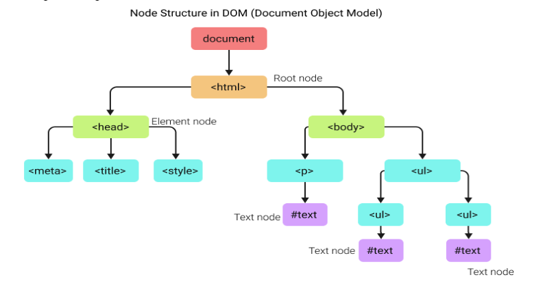

# Document Object Model (DOM)

1. Document
   আমরা আমাদের কম্পিউটারে বিভিন্ন রকমের ফাইল সেভ করে রাখি যেমন ছবি, ভিডিও। এগুলো একেকটা একেক রকমের Document। আমরা আমাদের html ফাইলকেও কোন একটা নাম দিয়ে সেভ করে রাখি। এবং এই ফাইলটাও একটা Document। এই Document কনসেপ্ট থেকেই এই Document শব্দটি এসেছে।

2. Object
   আমরা জানি যে Javascript আমাদের html কে interactive করে বা আমাদের ওয়েবপেজকে interactive করে।
   কিন্তু সে কীভাবে interactive করে? ফাইল সিস্টেম এর সাথে তো Javascript এর কোন কানেকশন নাই।। ব্রাউজারে যেই Javascript চলছে সে কিন্তু আমাদের ফাইল সিস্টেম কে অ্যাক্সেস করতে পারে না। ।
   তাহলে, এই যে আমরা html টা যেটা আমরা লিখছি, সেটা লেখার পরে আমরা ব্রাউজারে যে স্ট্রাকচার টা দেখছি সেটার সাথে সে কানেক্টিভিটি করে কীভাবে?
   Javascript আমাদের html কোডকে Javascript Object রূপান্তর করে। যেহেতু Object এ রূপান্তর করে, তাই এই Object থেকে এসেছে Object.

3. Model
   Javascript আমাদের html এর স্ট্রাকচারটাকে একটা tree model এর সাথে কল্পনা করে। তাই এই Model কে নেয়া হয়েছে।
   অর্থাৎ, আমাদের যে html document টাকে object এর যেই model এ পরিণত করা হয়েছে , সেটাই হচ্ছে Document Object Model বা সংক্ষেপে DOM
   এই object model টাই মুলত Javascript কে সেই পাওয়ার দিচ্ছে যেন সে ডাইনামিক html কে অ্যাক্সেস করতে পারে এবং শুধু তাই নয় ডাইনামিক html এর উপর যা খুশি তাই করতে পারে।

DOM আমাদের html ডকুমেন্টকে অবজেক্ট ওরিয়েন্টেডভাবে রিপ্রেজেন্ট করে যাতে আমরা ডমের সাহায্যে এই পেজের সাথে ইন্ট্যার‍্যাক্ট করতে পারি। এখন এই ইন্টার‍্যাকশানটা একটা প্রোগ্রামিং ল্যাংগুয়েজ বা জাভাস্ক্রিপ্ট দিয়েই করা হয়। এখন ডম যেহেতু অবজেক্ট রিপ্রেজেন্টশন, তো সেখানেও আমাদের জাভাস্ক্রিপ্ট এর অন্যান্য অবজেক্ট এর মতোই প্রপার্টি, মেথড থাকে। যেগুলোর সাহায্যে আমরা আমাদের পেজের সবকিছু অ্যাক্সেস করতে পারি, প্রয়োজনে মডিফাই করতে পারি সহজেই।
 
DOM is a document object model & programming interface for HTML that defines html properties, objects, events, and methods to get, change, add, or delete html elements
Dom is an interface of JavaScript.
 
We can get, change, add, or delete HTML elements with DOM.
 

 
D — Document
 
O — Object
 
M — Model (Document tree model)
 
What we can do with dom

- Change HTML element
- Change HTML attributes (id/class)
- Change CSS styles
- Add HTML elements & attributes
- Remove HTML elements & attributes
- React to HTML elements

There are 4 ways to catch any HTML element

1. getelementsByTagName() — return all similar tags in an array
2. getElementsByClassName() — return collection of all the same name classes as an array list of collection
3. getElemntById()
4. querySelector() / querySelectorAll()

> [!NOTE]
> Classlist, appendChild, createElement, innerText, getAttribute, setAttribute, event handler, event listener, stop propagation, event bubble, event delegation, matches()

> [!Difference between HTML Collection and Node Lists]

- HTMLCollections can be accessed by their name, index, and ID

* Nodelists can be accessed only by their index number

> querySelectorAll & getElementsByName returns node Lists

যখন আমরা প্যারেন্ট, চাইল্ড এই ধরনের রিলেশন নিয়ে কাজ করব বা appenChild, add node এই সমস্ত কাজ করার প্রয়োজন পরবে তখন আমরা node Lists নিয়ে কাজ করব।
আর যখন নরমাল HTML element ধরা, চেঞ্জ করার কাজ করব তখন আমরা HTMLCollection নিয়ে কাজ করব।
